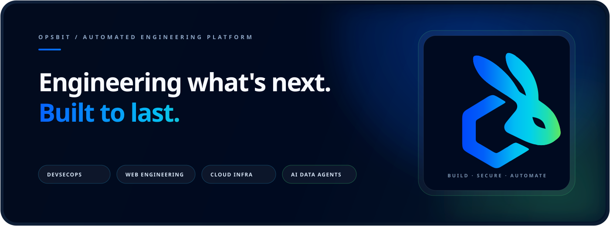
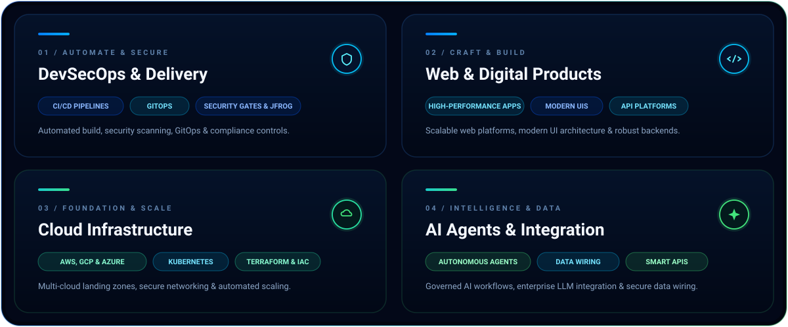

  

    

  
  
  
  
  

   

  `🛡️ 100% Infrastructure as Code` &nbsp;•&nbsp; `⚡ Zero-Downtime Continuous Delivery` &nbsp;•&nbsp; `🔒 Built-In Security Governance`

 

---

## ⚡ The Continuous Delivery Engine

At OpsBit, delivery is an automated, continuous loop — powered by our core engineering engine from architecture to production.

  

 

## 🛠️ Connected Engineering Disciplines

We bridge the gap between application development, multi-cloud infrastructure, Cisco networking & perimeter security controls, and intelligent automation.

  

 

---

## 🔄 Engagement Model

How we partner with engineering teams from initial concept to live production:

| Stage | Focus Area | Key Deliverables |
| :--- | :--- | :--- |
| **01. Audit & Architecture** | Multi-Cloud & Security Design | Infrastructure review, Cisco & Zero Trust threat modeling, and target architecture roadmap. |
| **02. Automate & Secure** | DevSecOps & Perimeter Security | Reproducible IaC, CI/CD pipelines, Cisco/F5/Zscaler/WAF integration, and GitOps controls. |
| **03. Production & Scale** | Governance & Monitoring | Zero-downtime deployment, real-time observability, and continuous AI data wiring. |

 

---

## 🧰 Technology Ecosystem

| Domain | Industry Standard Tools & Frameworks |
| :--- | :--- |
| **DevSecOps & Delivery** | `GitHub Actions` · `GitLab CI` · `Docker` · `Kubernetes` · `ArgoCD` · `JFrog Platform (Artifactory & Xray)` · `Fly.io` · `Trivy` · `Helm` |
| **Network & Enterprise Security** | `Cisco Networking & Security` · `F5 BIG-IP` · `Zscaler Zero Trust` · `WAF (Web Application Firewall)` · `Next-Gen Firewalls (NGFW)` · `Enterprise SD-WAN & VPN` · `DDoS Mitigation` |
| **Cloud & Infrastructure** | `AWS` · `Google Cloud (GCP)` · `Microsoft Azure` · `Fly.io` · `Terraform` · `OpenTofu` |
| **Web Engineering** | `TypeScript` · `Next.js` · `React` · `Node.js` · `Go` · `Python` · `GraphQL` |
| **AI & Data Automation** | `OpenAI` · `Anthropic` · `LangChain` · `PostgreSQL` · `Redis` · `Pinecone` |

 

---

## 🎯 Built for Impact & Reliability

- **Whole-System Ownership**: One connected conversation covering architecture, code, deployment, and cloud operations.
- **Security as Foundation**: Least privilege, strict trust boundaries, Cisco & Zscaler Zero Trust architecture, and continuous auditability built in.
- **Production-First Proof**: Observable, scalable, and maintainable systems over fragile one-off fixes.

 

  
  ### 💬 Ready to solve your hardest engineering challenge?

  [**Start a Conversation →**](mailto:info@opsbit.io) &nbsp;|&nbsp; [**info@opsbit.io**](mailto:info@opsbit.io) &nbsp;|&nbsp; [**Visit opsbit.io →**](https://opsbit.io)

   

  **OpsBit** · Engineering What's Next · Built with Intent

